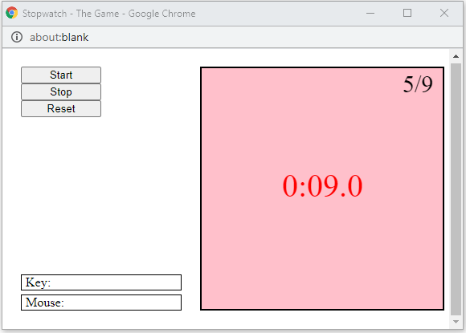

# Python Interactive Mini Games

Mini projects from Coursera's `An Introduction to Interactive Programming in Python` [Part 1](https://www.coursera.org/learn/interactive-python-1) [Part 2](https://www.coursera.org/learn/interactive-python-2).

### Rock paper scissors lizard Spock

[Play here!](http://www.codeskulptor.org/#user47_QoMBRhEwVZmLmms_0.py)

### Guess: The Game

Instructions:  
Guess a number within the range. Use the hints (higher/lower) wisely before you run out of your allowed number of guesses!

[Play here!](http://www.codeskulptor.org/#user38_1oRa1Zl0zyjBZcf.py)

### Stopwatch: The Game

[Play here!](http://www.codeskulptor.org/#user38_I01TforPCQ0pQTe.py)

Instructions:  
After starting the game, click the Stop button only when the tenths digit hits 0 (zero) in order to score a point. Let’s see how fast you can react!

### Pong

[Play here!](http://www.codeskulptor.org/#user38_NmOBJtZSuxdyNZQ.py)

Instructions:  
Use the keys `w,a,s,d` using left hand and arrow keys using right hand. Yes, you are your own opponent.

### Memory

[Play here!](http://www.codeskulptor.org/#user38_ZOvg6sBQOThIY1L.py)

Instructions:  
Match all card pairs using minimum turns.

### Blackjack

[Play here!](http://www.codeskulptor.org/#user38_EeJF6Wes6BZQphV.py)

Instructions:  
Deal, then Hit/Stand.

### Ricerocks

[Play here!](http://www.codeskulptor.org/#user38_ltFkp5gL7Pnp14v.py)

Instructions:  
Navigate your spaceship using arrow keys. Use space bar to fire missiles.

